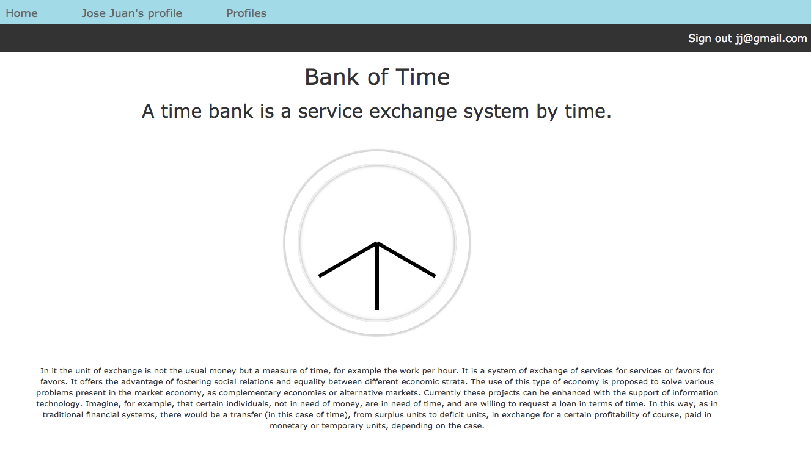

# Bank of Time

<https://bank-of-time.herokuapp.com/>

## Motivation

Bank of time is an application to contact people that need help with a task and people who are masters on that task. The person who is the helper or the provider receive a credit for the same amount of hour that he use on the task. This credit can be used on someone who help him/her in another task.

This project is part of the Web Developer immersive in General Assembly in Sydney.

## Technologies Used

* Ruby 2.4.1p111
* Rails 5.1.6
* HTML _ JavaScript
* CSS
* jQuery
* Heroku
* Cloudinary
* Bcrypt
* Postgresq
* Google map API
* Geocoder

## Approach

## TODO

## License & Copyright

Copyright (c) 2018 Jose Juan Parra Alcolea

Licensed under [MIT License](LICENSE).
